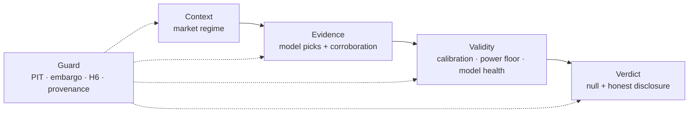

<div align="center">
  
</div>

# Aionis

<div align="center">

[简体中文](README.md) · **English**

[](LICENSE)
[](pyproject.toml)
[](https://docs.astral.sh/uv/)

</div>

> **A quantitative research harness that treats falsifiability as an engineering
> constraint**: freeze the claim first, let the data render the verdict — and
> record an honest "no increment" as a legitimate experimental outcome.

**The verdict in one line**: all four incremental-information claims (B/C/D/E1)
and the first chronological confirmatory OOS (Track C) returned **NULL** — point
estimates not significantly different from zero. This is not a failure: it is
the result delivered exactly as pre-registered.

> ⚠️ **Disclaimer**: this project is for research and educational purposes only
> and is **not investment advice**. It is not a trading system and has no
> deployable live track record (E3 forward accumulation is explicitly **NO-GO**,
> see ④). Do not make financial decisions based on its output; use at your own
> risk.

<div align="center">

[① What this is](#about) · [② Headline results](#results) · [③ Anti-leakage identity](#guard) · [④ Roadmap](#roadmap) · [⑤ Research terminal](#terminal)
[⑥ Quant dashboard](#dashboard) · [⑦ Install & reproduce](#install) · [⑧ Data & licensing](#data) · [⑨ What we do NOT claim](#scope) · [⑩ Glossary](#glossary) · [⑪ References](#refs) · [⑫ Governance & docs](#governance)

</div>

<a id="about"></a>
## ① What this is

Aionis answers questions of the form: "does feature set X add **incremental**
cross-sectional predictability over a fundamentals-only baseline?" — in essence
an **ablation** against the baseline: the claim is not "we can predict", but
"we know *more* than what is already embedded in known information".

Every claim is **pre-registered** before freezing (`docs/phase-*-preregistration.md`,
a port of the clinical-trials preregistration culture); the frozen config's
sha256 is written to an append-only ledger (`runs/ledger.jsonl`) *before* any
out-of-sample metric is observed; same-signature reruns must be bit-identical.
A changed config is a new ledger row, never a silent overwrite — a headline
cannot be "rerun-to-significance" rescued. Aionis is **not** a cognitive system
and **not** a trading bot.

<a id="results"></a>
## ② Headline results

Same S&P 500 PIT universe (588 clean tickers, 2016+, 125 months), frozen
nine-column baseline, fixed LightGBM, `PurgedGroupKFold(5, embargo=21)`. The
falsifiable claim is the treatment-minus-baseline monthly rank-IC differential.
Note: these are shared-fold purged cross-fitted/OOF comparisons — **not**
strictly chronological OOS and not a live track record (chronological
confirmation is the job of Track C / E3).

| phase | axis (treatment vs baseline) | differential | 95% CI | p-value* | verdict |
|---|---|---:|---|---:|---|
| **B** | fundamental *timing* (filed vs period-end+lag) | −0.000800 | [−0.01057, +0.00897] | 0.872 | no significant positive increment |
| **C** | world-state *surprise* bundle (CPI/NFP/VIX/earnings) | −0.006487 | [−0.01953, +0.00656] | 0.355 | no significant positive increment |
| **D** | *relationship* bundle (SIC peer momentum + 13D events) | −0.002980 | [−0.01371, +0.00775] | 0.597 | no significant positive increment |
| **E1** | cross-firm *propagation* beyond own shocks | −0.002793 | [−0.01146, +0.00587] | 0.533 | no significant positive increment |

\* C/D/E1 are Diebold-Mariano test p-values (moving-block-bootstrap variance);
B is the paired HAC recompute (2026-08-05) from the IC series saved under ledger
row #28, p=0.872 (the row's own `dm_p_mbb`=0.870, same tail; the append-only
ledger row is unchanged). All differentials are the bit-exact values of
`runs/results/<sig>/differential.json`, pinned row-by-row by this project's
contract tests.

**How to read this table** (statistical literacy):

- A negative differential **≠** "the feature is harmful" — the negative point
  estimate is statistically indistinguishable from zero.
- A CI bracketing zero **≠** "the effect is exactly zero" — non-significance is
  not equivalence (equivalence requires a pre-registered SESOI/TOST, below).
- All four phases are **zero-LLM**: B uses EDGAR numeric fundamentals timing,
  C macro/earnings numeric surprises, D SIC peer momentum + 13D event flags,
  E1 deterministic propagation — LLM features inside the frozen OOS are a known
  leakage channel and are deliberately excluded.
- The h=10/42 horizon sweep is **exploratory** sensitivity evidence (all eight
  intervals cross zero, `docs/RESULTS.md` §3); the strategy-return lens covers
  B/C only, is gross-of-costs with no turnover constraint, and is not
  significant (DSR/SPA) — neither constitutes independent replication.

### Track C — first chronological confirmatory OOS (ledger #49)

A joint US (S&P 500) + CN (CSI 300) walk-forward cross-sectional monthly
rank-IC with a single pre-specified regime interaction (multiplicity budget = 1):

| metric | value | reading |
|---|---|---|
| combined rank-IC mean | **−0.0088** | null (p_hac=0.484; 95% HAC CI [−0.034, +0.016] brackets zero; n=71 months) |
| J-T look-1 (n=60, RCI 99.44%) | **NOT_EQUIVALENT** | RCI wider than the ±0.010 SESOI = an underpowered look, **not** an effect signal |
| H6 double-run bit-identical | PASS | determinism verified on real data |

One honest piece of domain context on power: a monthly cross-sectional
rank-IC of ≈0.02–0.05 is already considered informative in practice (under the
Grinold-Kahn fundamental law IR ≈ IC·√BR it compounds into a meaningful ICIR);
this project's pre-registered ±0.010 SESOI is a **small-effect** bar — and
precisely because the effect size is small, distinguishing "zero" from "small"
requires an extremely long sample. A prospective power analysis shows the
frozen 60/90/120-month Jennison-Turnbull schedule would need ~36+ years to
declare equivalence. The honest, pre-registered contribution is therefore the
**null point estimate + the end-to-end anti-leakage discipline + the
power-limit disclosure** — not a declared equivalence. Full methods and the
15-row evidence table: `archive/docs/methods-and-results-draft.md`; living
snapshot: [`docs/RESULTS.md`](docs/RESULTS.md).

<a id="guard"></a>
## ③ The anti-leakage identity (why the results are auditable)

```mermaid
flowchart LR
    F["① Freeze config"] --> L["② config_committed<br/>sha256 ledgered BEFORE result"]
    L --> P["③ PIT data<br/>filed dates · ALFRED vintages<br/>PIT constituents"]
    P --> V["④ PurgedGroupKFold<br/>group=month · embargo=21 sessions"]
    V --> M["⑤ Frozen learner<br/>LightGBM · seeds=0 · n_jobs=1"]
    M --> R["⑥ rank-IC differential<br/>treatment − baseline"]
    R --> C["⑦ Controls & multiple testing<br/>placebo · leave-one-out · DSR/SPA"]
    C --> H["⑧ H6 determinism<br/>double-run bit-identical"]
    H --> D["⑨ Verdict ledgered<br/>NULL recorded honestly"]
```



Six anchors, each with a citable methodological pedigree:

| mechanism | guards against | methodological anchor |
|---|---|---|
| `config_committed` BEFORE result | p-hacking / rerun-to-significance | a port of clinical-trial preregistration (endpoints frozen before unblinding) |
| PIT data (filed / vintage / point-in-time constituents) | lookahead / survivorship bias | aligning fundamentals to filing dates is standard factor-research discipline |
| PurgedGroupKFold + embargo | overlapping-label leakage | López de Prado (2018) §7: Purged K-Fold + Embargo |
| H6 determinism (seeds=0 · n_jobs=1 · pinned versions) | irreproducibility | double-run IC series **and** raw scores bit-identical (asserted) |
| DSR / SPA / placebo / leave-one-out | multiple testing / data snooping | Bailey & López de Prado (2014); Hansen (2005); White (2000) |
| rank-IC differential + HAC/MBB inference | scale drift / serial correlation | Diebold & Mariano (1995); moving-block bootstrap Künsch (1989) |

Boundary note: PurgedGroupKFold purges overlapping labels but cross-fits from
the test complement, which may include later months — so it does **not**
establish chronological validation. That is precisely why Track C / E3 exist.

<a id="roadmap"></a>
## ④ Roadmap A→E

Each phase poses exactly one falsifiable claim on the same benchmark (TCR —
Theory of Computable Reality,
[`docs/theory-of-computable-reality.md`](docs/theory-of-computable-reality.md)):

| phase | claim (treatment vs baseline) | status | verdict |
|---|---|---|---|
| **A** | ERL event-representation pilot (FOMC statements) | done | underpowered historical pilot (DA-lift +5.5pp, CI crosses zero) |
| **B** | fundamental timing (filed vs period-end+lag) | done | no significant positive increment (table above) |
| **C** | world-state surprise bundle | done | no significant positive increment |
| **D** | relationship/network bundle (13D + SIC peers) | done | no significant positive increment |
| **E1** | structural cross-firm shock propagation | done | no significant positive increment |
| **Track C** | dual-region joint chronological confirmatory OOS | done (ledger #49) | null; look-1 underpowered NOT_EQUIVALENT |
| **E2** | LLM macro-causal hypothesis generator (cutoff-controlled) | designed | the cutoff gate makes the backtest underpowered (~10–18 post-cutoff months) |
| **E3** | forward-live accumulation | engineering-ready | **headline NO-GO**: no shadow/headline result, no live track record; GO is an owner gate |

On the E2/E3 vision ("see-through-to-essence" causal prediction:
pandemic→pharma, AI→compute→power): backtesting with a current LLM leaks by
construction — it has memorized the outcomes. **E3 forward-live is the only
honest path.** Pre-registrations:
[`docs/phase-{b,c,d,e,e2,e3}-preregistration.md`](docs/phase-b-preregistration.md)
and [`docs/track-c-preregistration.md`](docs/track-c-preregistration.md).

<a id="terminal"></a>
## ⑤ Research terminal (web, deployed)

The public face of the project: a **validity-argument chain** organizing one
falsifiable claim's argument as a site. Every page declares its place on the
chain, every number carries provenance (as-of watermarks), and AI contributes
**interpretation and coverage only** — never an out-of-sample signal.

**Live**: <https://rethymus.github.io/Aionis/> · Docs: [`web/README.md`](web/README.md)



- **Data panels**: 56 committed export panels (`n_panels` and per-panel as-of
  watermarks published on `/data-health`) — the EDGAR family (13D/13G ·
  Form 4 · 8-K · DEF 14A · Form D · 13F · IPO 424B4 · unified filing stream),
  FRED/ALFRED, Tiingo, Alpaca, CFTC COT, GDELT news, official ARK holdings,
  ApeWisdom, Reddit, CSI 300 constituents, and more; dual-region (US + CN),
  bilingual (zh/en); model cards exported per the Mitchell et al. (2019)
  model-card convention.
- **Honest disclosure**: per-panel as-of watermarks are published on
  `/data-health`; tickers outside the universe gate degrade to plain text (no
  links); live prices (Cloudflare Worker, `workers/prices/`) are **display-only**
  — any research module importing live prices = lookahead leakage.

```bash
cd web && pnpm install && pnpm dev      # http://localhost:3000
```

<a id="dashboard"></a>
## ⑥ Quant-eval dashboard (local, Streamlit + Plotly)

11 tabs: overview / fit quality / volatility / curve evolution / event study /
uncertainty / horizon robustness / coverage / strategy return / forward IC /
run history.

```bash
uv run streamlit run dashboard/app.py
```

Current data demonstrates the analysis methods and interaction structure (not
final conclusions); recorded evidence lives in [`docs/RESULTS.md`](docs/RESULTS.md).

<a id="install"></a>
## ⑦ Install & reproduce

Requires Python ≥ 3.10 and [uv](https://docs.astral.sh/uv/).

```bash
uv sync --all-extras          # base + extraction + dashboard + dev
cp .env.example .env          # fill FRED_API_KEY / TIINGO_API_KEY / ALPACA_* / REDDIT_* (LLM keys optional)

# one-time data fetch (fundamentals + prices for the 588-ticker PIT universe; resumable, polite)
uv run python scripts/phase_b_fetch.py

# a confirmatory run (e.g. Phase D): config_committed BEFORE result, H6-verified
uv run python scripts/phase_d_run.py

uv run pytest -q              # hermetic test suite
uv run ruff check             # lint must be clean
```

Each `scripts/phase_{b,c,d,e1}_run.py` is a thin wrapper over its testable
orchestrator (`src/aionis/eval/phase_*.py`); `scripts/strategy_eval_run.py` runs
the secondary L-S lens; and `scripts/sensitivity_horizon.py` runs the horizon
sweep. Most scripts support a `PHASE_X_NO_LEDGER=1` reproducibility mode.

Stack: pandas / numpy / pyarrow · scikit-learn · **LightGBM ≥4.3 (frozen
learner)** · xgboost · statsmodels · purgedcv (PurgedGroupKFold) · arch ≥8.0
(DSR/SPA) · pandas-market-calendars · pydantic · structlog. The terminal is a
Next.js static export (GitHub Pages).

<a id="data"></a>
## ⑧ Data, models & licensing

- **Working sources**: FRED/ALFRED, Tiingo, Alpaca, SEC EDGAR; **blocked**:
  yfinance/Yahoo, BLS, Stooq.
- **Politeness is binding**: ≥2 s spacing + exponential backoff on data-fetch
  sites; model APIs are rate-limited by provider RPM/TPM
  (`src/aionis/extraction/providers.py`).
- **LLM pool is GLM / SiliconFlow / ModelScope only** (OpenAI-compatible,
  policy-aware multi-key router). LLMs produce **no signal** inside the frozen
  OOS pipeline; E2 is gated by an empirically probed provider cutoff
  (2023-03-10, conservative lower bound).
- **7-gate data intake** ([`docs/data-intake-rubric.md`](docs/data-intake-rubric.md)):
  license / PIT / no-revision / snapshot / exploratory-only / selection-honesty /
  politeness; permissive licenses only (MIT/Apache/BSD,
  [`docs/data-license-allowlist.md`](docs/data-license-allowlist.md)) — in spirit
  a cousin of Gebru et al. (2018) datasheets: every dataset registers provenance
  and limits.
- **No mock/synthetic data in the research pipeline** (labeled unit-test fixtures
  only); `.env`, `data/`, `*.parquet` are never committed.

<a id="scope"></a>
## ⑨ What we deliberately do NOT claim

The other half of falsifiability is **not over-claiming**. The current results
do **not** prove: market efficiency; full information pricing; an effect
exactly equal to zero (non-significance ≠ equivalence); tradability (no
net-of-cost backtest); or generalization beyond the frozen universe /
features / learner / validation. A learned generative "world model" is
**infeasible at this scale and leakage-prone**
([`docs/frontier_positioning.md`](docs/frontier_positioning.md) + TCR §8.5);
the five-layer cognitive architecture and self-evolution engine are what this
experiment is meant to *justify building next* — not built speculatively.

<a id="glossary"></a>
## ⑩ Glossary

| term | one-line definition |
|---|---|
| rank-IC | Spearman rank correlation between cross-sectional scores and forward returns (monthly); the factor-research standard, robust to outliers |
| PIT (point-in-time) | only what was knowable then: fundamentals by `filed` date, macro by vintage, constituents by same-day membership |
| embargo / purge | the isolation buffer and label-overlap removal between train/validation (López de Prado 2018) |
| SESOI / TOST | smallest effect size of interest / two one-sided tests — the pre-registered route to declaring equivalence |
| DM-p / HAC / MBB | Diebold-Mariano forecast-comparison test / heteroskedasticity-autocorrelation-robust variance / moving-block bootstrap |
| DSR / SPA | Deflated Sharpe Ratio (penalizes trial count) / Superior Predictive Ability test (multiple-testing correction) |
| H6 | the determinism contract: same-sig reruns reproduce IC series and raw scores bit-identically (seeds=0, n_jobs=1, pinned versions) |
| zero-LLM | the claim's feature pipeline contains no LLM-generated features (guards against LLM-recall leakage) |

<a id="refs"></a>
## ⑪ Methodological references

- López de Prado, M. (2018). *Advances in Financial Machine Learning*. Wiley. (Purged K-Fold + Embargo)
- Bailey, D. H., & López de Prado, M. (2014). The Deflated Sharpe Ratio. *Journal of Portfolio Management*, 40(5).
- Hansen, P. R. (2005). A Test for Superior Predictive Ability. *Econometrica*, 73(1).
- White, H. (2000). A Reality Check for Data Snooping. *Econometrica*, 68(5).
- Diebold, F. X., & Mariano, R. S. (1995). Comparing Predictive Accuracy. *Journal of Business & Economic Statistics*, 13(3).
- Künsch, H. R. (1989). The Jackknife and the Bootstrap for General Stationary Observations. *Annals of Statistics*, 17(3).
- Harvey, C. R., Liu, Y., & Zhu, H. (2016). …and the Cross-Section of Expected Returns. *Review of Financial Studies*, 29(1). (the multiple-testing t-hurdle in factor research)
- Jennison, C., & Turnbull, B. W. (2000). *Group Sequential Methods with Applications to Clinical Trials*. Chapman & Hall/CRC. (the J-T look design)
- Schuirmann, D. J. (1987). A Comparison of the Two One-Sided Tests Procedure and the Power Approach for Assessing the Equivalence of Average Bioavailability. *Journal of Pharmacokinetics and Biopharmaceutics*, 15(6). (TOST)
- Grinold, R. C., & Kahn, R. N. (2000). *Active Portfolio Management* (2nd ed.). McGraw-Hill. (the IC / IR fundamental law)
- Mitchell, M. et al. (2019). Model Cards for Model Reporting. *FAT\* 2019*.; Gebru, T. et al. (2021). Datasheets for Datasets. *Communications of the ACM*, 64(12).

*Note: citations point to the methodology itself for follow-up reading; this
project is not affiliated with the authors.*

<a id="governance"></a>
## ⑫ Governance & docs

- **Governance anchors**: [`CLAUDE.md`](CLAUDE.md) (project rules; [`AGENTS.md`](AGENTS.md)
  is a byte-identical mirror file — the same git blob twice — for multi-tool
  portability) · [`WORKFLOW.md`](WORKFLOW.md) (the 11-stage operating constitution) ·
  [`CONTRIBUTING.md`](CONTRIBUTING.md) (Conventional Commits + ledger rule +
  secrets/data policy).
- **Operating state**: [`state/current.md`](state/current.md) (read first each
  session) · `state/handoff.md` · `state/backlog.md` · `state/blockers.md`.
- **Docs index**: [`docs/RESULTS.md`](docs/RESULTS.md) (falsifiable-results
  snapshot) ·
  [`reports/audits/claim-reconciliation.md`](reports/audits/claim-reconciliation.md)
  (Fact/Inference/Hypothesis reconciliation) · `docs/00-vision.md` …
  `docs/08-lessons.md` (numbered canonical index) ·
  [`decisions/index.md`](decisions/index.md) (ADR registry).
- **Ledger**: `runs/ledger.jsonl` (append-only, **tracked** audit log);
  `runs/results/`, `runs/*.log`, `runs/*.parquet` are gitignored regenerable
  artifacts.
- **Citing this repository**: see [`CITATION.cff`](CITATION.cff). Code license:
  MIT ([`LICENSE`](LICENSE)); third-party data-source licensing separately in
  [`docs/data-license-allowlist.md`](docs/data-license-allowlist.md).

New phases run the same anti-leakage pipeline: freeze config →
`config_committed` ledger row → PIT data → declared validation kind → frozen
learner → rank-IC differential → controls → H6 → verdict. Acceptance gates:
[`docs/05-acceptance.md`](docs/05-acceptance.md).

---

<div align="center">

[中文版](README.md) · Code license MIT: [LICENSE](LICENSE) · Data-source licensing: [docs/data-license-allowlist.md](docs/data-license-allowlist.md)

</div>
