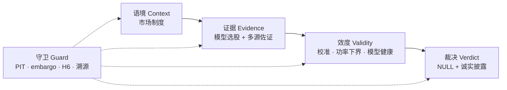

<div align="center">
  
</div>

# Aionis

<div align="center">

**简体中文** · [English](README.en.md)

[](LICENSE)
[](pyproject.toml)
[](https://docs.astral.sh/uv/)

</div>

> **一个把"可证伪"当工程约束来实现的量化研究实验台**：先冻结主张，再让数据裁决——
> 并把"无增量"这个裁决当作合格的实验产出，如实入账。

**一句话结论**：四个增量信息主张（B/C/D/E1）与首条时序 confirmatory OOS（Track C）
的裁决全部为 **NULL** ——点估计不显著异于零。这不是失败，是按预注册交付的结果。

> ⚠️ **免责声明**：本项目仅供研究与教育用途，**不构成任何投资建议**。它不是交易
> 系统，也没有任何可部署的实盘业绩（E3 前向积累明确 **NO-GO**，见 ④）。请勿依据
> 本项目输出做出资金决策；使用风险自担。

<div align="center">

[① 这是什么](#about) · [② 当前结论](#results) · [③ 抗泄漏机制](#guard) · [④ 研究路线](#roadmap) · [⑤ 研究终端](#terminal)
[⑥ 本地仪表盘](#dashboard) · [⑦ 安装与复现](#install) · [⑧ 数据与许可](#data) · [⑨ 不主张什么](#scope) · [⑩ 术语表](#glossary) · [⑪ 参考文献](#refs) · [⑫ 治理与文档](#governance)

</div>

<a id="about"></a>
## ① 这是什么

Aionis 回答的问题形如："特征集 X 相比纯基本面基线，是否带来**增量**截面可预测性？"
——本质上是对基线的一次**消融对照**（ablation）：主张的不是"能预测"，而是
"在已知信息之上**多**知道了一点"。

每个主张在冻结前**预注册**（`docs/phase-*-preregistration.md`，移植临床试验的预注册文化）；
配置的 sha256 在观测任何样本外指标**之前**写入 append-only 账本（`runs/ledger.jsonl`）；
之后同签名重跑必须逐位一致。换配置 = 新账本行，绝无静默覆盖——headline 无法靠
"重跑到显著"营救。Aionis **不是**认知系统，也**不是**交易机器人。

<a id="results"></a>
## ② 当前结论（headline）

同一标普 500 PIT 宇宙（588 只可解析 ticker，2016+，125 个月）、冻结九列基线、固定
LightGBM、`PurgedGroupKFold(5, embargo=21)`。可证伪主张 = treatment − baseline 的
月度 rank-IC 差分。注意：这些是 shared-fold purged cross-fitted/OOF 差分，**不是**
严格时序 OOS，也不是 live track record（时序确认由 Track C / E3 承担）。

| 阶段 | 检验轴（treatment vs 基线） | 差分 | 95% CI | p 值* | 裁决 |
|---|---|---:|---|---:|---|
| **B** | 基本面*时点*（filed vs 期末+滞后） | −0.000800 | [−0.01057, +0.00897] | 0.872 | 无显著正增量 |
| **C** | 世界状态 *surprise* 组（CPI/NFP/VIX/盈利） | −0.006487 | [−0.01953, +0.00656] | 0.355 | 无显著正增量 |
| **D** | *关系*组（SIC 同业动量 + 13D 事件） | −0.002980 | [−0.01371, +0.00775] | 0.597 | 无显著正增量 |
| **E1** | 跨公司*传播*（超出自身冲击） | −0.002793 | [−0.01146, +0.00587] | 0.533 | 无显著正增量 |

\* C/D/E1 为 Diebold-Mariano 检验 p 值（moving-block bootstrap 方差）；B 为 2026-08-05 对
账本 #28 保存的 IC 序列做的 paired HAC 补算 p=0.872（账本行内 `dm_p_mbb`=0.870，同尾；
账本行 append-only 未改）。全部差分值为 `runs/results/<sig>/differential.json` 的逐位原值，
四行均经本项目契约测试钉死。

**如何读这张表**（方法学教养）：

- 差分点估计为负 **≠** "该特征有害"——负值与零在统计上不可区分。
- CI 跨零 **≠** "效应严格等于零"——非显著不是等价证明（等价要靠 SESOI/TOST，见下）。
- 四相均为 **zero-LLM** 特征：B 是 EDGAR 数值基本面时点，C 是宏观/盈利数值 surprise，
  D 是 SIC 同业动量 + 13D 事件旗标，E1 是确定性传播——LLM 特征进冻结 OOS 是已知
  泄漏通道，被刻意排除。
- h=10/42 视界扫描是**探索性**敏感性证据（8 个区间全跨零，`docs/RESULTS.md` §3）；
  策略收益次级透镜仅覆盖 B/C、gross-of-costs、无换手约束（DSR/SPA 不显著）——
  两者都不构成独立复制。

### Track C — 首条时序 confirmatory OOS（账本 #49）

美中双区域（标普 500 + 沪深 300）联合 walk-forward 月度 rank-IC，单一预指定 regime
交互（多重性预算 = 1）：

| 指标 | 数值 | 解读 |
|---|---|---|
| 联合 rank-IC 均值 | **−0.0088** | NULL（p_hac=0.484；95% HAC CI [−0.034, +0.016] 跨零；n=71 个月） |
| J-T look-1（n=60，RCI 99.44%） | **NOT_EQUIVALENT** | RCI 宽于 ±0.010 SESOI = look 欠功率，**不是**效应信号 |
| H6 双跑逐位一致 | PASS | 真实数据上的确定性核验 |

关于功效，一个诚实的学科背景：实务中月频截面 rank-IC≈0.02–0.05 即被视为有信息量
（Grinold-Kahn 基本定律 IR ≈ IC·√BR 下已可积累可观的 ICIR）；本项目预注册的
SESOI ±0.010 是**小效应**门槛——正因效应量如此之小，区分"零"与"小"需要极长样本，
前瞻功效分析显示冻结的 60/90/120 月 Jennison-Turnbull 计划宣布等价需要 ~36+ 年。
因此本项目诚实交付的是**零点估计 + 端到端抗泄漏纪律 + 功率极限披露**，
而非"宣布等价"。完整方法与 15 行证据表：`archive/docs/methods-and-results-draft.md`；
活页快照：[`docs/RESULTS.md`](docs/RESULTS.md)。

<a id="guard"></a>
## ③ 抗泄漏机制（结果为何可审计）


六道锚点，每道都有可考的文献出处：

| 机制 | 防什么 | 方法学锚点 |
|---|---|---|
| `config_committed` 先于结果 | p-hacking / 重跑到显著 | 临床试验预注册文化的移植（终点冻结先于揭盲） |
| PIT 数据（filed / vintage / 时点成分） | 前视偏差 / 幸存者偏差 | 基本面按申报日对齐是 factor research 的标准纪律 |
| PurgedGroupKFold + embargo | 标签重叠泄漏 | López de Prado (2018) §7：Purged K-Fold + Embargo |
| H6 确定性（seeds=0 · n_jobs=1 · 版本钉死） | 不可复现 | 双跑 IC 序列**与**原始打分 bit-identical（有断言） |
| DSR / SPA / 安慰剂 / leave-one-out | 多重检验 / 数据挖掘偏差 | Bailey & López de Prado (2014)；Hansen (2005)；White (2000) |
| rank-IC 差分 + HAC/MBB 推断 | 量纲漂移 / 序列相关 | Diebold & Mariano (1995)；移动块自助 Künsch (1989) |

注意 PurgedGroupKFold 的边界：它清除标签区间重叠，但从测试补集交叉拟合、可能包含
更晚月份，因此**不构成时序验证**——这正是 Track C / E3 存在的理由。

<a id="roadmap"></a>
## ④ 研究路线 A→E

每阶段在同一基准上做且只做一个可证伪主张（TCR：Theory of Computable Reality，
[`docs/theory-of-computable-reality.md`](docs/theory-of-computable-reality.md)）：

| 阶段 | 主张（treatment vs 基线） | 状态 | 裁决 |
|---|---|---|---|
| **A** | ERL 事件表示 pilot（FOMC 声明） | 完成 | 欠功率历史 pilot（DA-lift +5.5pp，CI 跨零） |
| **B** | 基本面时点（filed vs 期末+滞后） | 完成 | 无显著正增量（见上表） |
| **C** | 世界状态 surprise 组 | 完成 | 无显著正增量 |
| **D** | 关系网络（SIC 同业动量 + 13D） | 完成 | 无显著正增量 |
| **E1** | 跨公司冲击传播 | 完成 | 无显著正增量 |
| **Track C** | 双区域联合时序 confirmatory OOS | 完成（账本 #49） | NULL；look-1 欠功率 NOT_EQUIVALENT |
| **E2** | LLM 宏观因果假设生成（cutoff 受控） | 设计完成 | cutoff 门使回测欠功率（~10–18 个 cutoff 后月份） |
| **E3** | forward-live 前向积累 | 工程就绪 | **headline NO-GO**：无 shadow/headline 结果、无 live track record；GO 为业主门 |

E2/E3 的愿景（"看透本质"的因果预测：疫情→医药、AI→算力→电力）用当下 LLM 回测天然
泄漏——模型已记住结局；**E3 前向积累是唯一诚实路径**。预注册见
[`docs/phase-{b,c,d,e,e2,e3}-preregistration.md`](docs/phase-b-preregistration.md)
与 [`docs/track-c-preregistration.md`](docs/track-c-preregistration.md)。

<a id="terminal"></a>
## ⑤ 研究终端（web，已部署）

项目的公开面孔：一条**效度论证链**（validity-argument chain），把单个可证伪主张的
论证过程组织成站点。每页声明自己在链上的位置，每个数字携带出处（as-of 水位），
AI 只承担**解释与覆盖**——绝不产生样本外信号。

**在线**：<https://rethymus.github.io/Aionis/> · 文档：[`web/README.md`](web/README.md)



- **数据面板**：56 个 committed 导出面板（`/data-health` 逐项公示 `n_panels` 与
  as-of 水位）——EDGAR 全家桶（13D/13G · Form 4 · 8-K ·
  DEF 14A · Form D · 13F · IPO 424B4 · 统一申报流）、FRED/ALFRED、Tiingo、Alpaca、
  CFTC COT、GDELT 新闻、ARK 官方持仓、ApeWisdom、Reddit、沪深 300 成分等；
  美中双区域、中英双语；模型卡按 Mitchell et al. (2019) 模型卡规范导出。
- **诚实披露**：每面板 as-of 水位在 `/data-health` 逐项公示；宇宙门外 ticker 降级纯文本
  不发链；实时价格（Cloudflare Worker，`workers/prices/`）**仅限展示层**——任何研究
  模块引入实时价格 = 前视泄漏。

```bash
cd web && pnpm install && pnpm dev      # http://localhost:3000
```

<a id="dashboard"></a>
## ⑥ 本地量化仪表盘（Streamlit + Plotly）

11 个标签：总览 / 拟合质量 / 波动率 / 曲线演化 / 事件研究 / 不确定性 / 视界稳健性 /
覆盖 / 策略收益 / 前向 IC / 运行史。

```bash
uv run streamlit run dashboard/app.py
```

当前数据演示的是分析方法与交互结构（非最终结论）；记录在案的证据见
[`docs/RESULTS.md`](docs/RESULTS.md)。

<a id="install"></a>
## ⑦ 安装与复现

要求 Python ≥ 3.10 与 [uv](https://docs.astral.sh/uv/)。

```bash
uv sync --all-extras          # base + extraction + dashboard + dev
cp .env.example .env          # 填 FRED_API_KEY / TIINGO_API_KEY / ALPACA_* / REDDIT_*（LLM key 可选）

# 一次性数据抓取（588 只 PIT 宇宙的基本面 + 价格；可断点续跑、礼貌限速）
uv run python scripts/phase_b_fetch.py

# 一条 confirmatory run（以 Phase D 为例）：config_committed 先于结果，H6 验证
uv run python scripts/phase_d_run.py

uv run pytest -q              # 封闭（hermetic）测试套件
uv run ruff check             # lint 必须干净
```

`scripts/phase_{b,c,d,e1}_run.py` 是各可测试编排器（`src/aionis/eval/phase_*.py`）的薄封装；
`scripts/strategy_eval_run.py` 跑次级 L-S 透镜；`scripts/sensitivity_horizon.py` 跑视界扫描。
多数脚本支持 `PHASE_X_NO_LEDGER=1` 复现模式（不写账本）。

技术栈：pandas / numpy / pyarrow · scikit-learn · **LightGBM ≥4.3（冻结学习器）** ·
xgboost · statsmodels · purgedcv（PurgedGroupKFold）· arch ≥8.0（DSR/SPA）·
pandas-market-calendars · pydantic · structlog。终端为 Next.js 静态导出（GitHub Pages）。

<a id="data"></a>
## ⑧ 数据、模型与许可

- **工作源**：FRED/ALFRED、Tiingo、Alpaca、SEC EDGAR；**屏蔽源**：yfinance/Yahoo、
  BLS、Stooq。
- **爬取礼貌是硬约束**：数据站点 ≥2 秒间隔 + 指数退避；模型 API 走提供商 RPM/TPM 限速
  （`src/aionis/extraction/providers.py`）。
- **LLM 池仅限 GLM / SiliconFlow / ModelScope**（OpenAI 兼容、多 key 策略路由）。LLM 在
  冻结样本外管线中**不产生信号**；E2 以经验探针实证的 provider cutoff（2023-03-10，
  保守下界）门控。
- **7 门数据准入**（[`docs/data-intake-rubric.md`](docs/data-intake-rubric.md)）：许可 /
  PIT / 不修订 / 快照 / 仅探索 / 选择诚实 / 爬取礼貌；仅允许宽松许可（MIT/Apache/BSD，
  [`docs/data-license-allowlist.md`](docs/data-license-allowlist.md)）——精神上接近
  Gebru et al. (2018) 的 datasheets：每个数据集登记出处与边界。
- **研究管线禁用 mock/合成数据**（仅限打标的单元测试夹具）；`.env`、`data/`、
  `*.parquet` 永不入库。

<a id="scope"></a>
## ⑨ 明确不主张什么

可证伪性的另一半是**不过度主张**。当前结论**不**证明：市场有效、信息已完全定价、
效应严格等于零（非显著 ≠ 等价）、策略可交易（无净成本回测）、或结论可外推到
冻结宇宙/特征/学习器/验证之外。学习型生成式"世界模型"在此规模**不可行且天然泄漏**
（[`docs/frontier_positioning.md`](docs/frontier_positioning.md) 与 TCR §8.5 的裁决）；
五层认知架构与自进化引擎是这套实验**要为下一步正当性作证的对象**——不是先建再说。

<a id="glossary"></a>
## ⑩ 术语表

| 术语 | 一句话定义 |
|---|---|
| rank-IC | 截面打分与前向收益的 Spearman 秩相关（月频），因子研究标准量；对离群值稳健 |
| PIT（点时） | 只用"当时能看到"的数据：基本面按 `filed` 日、宏观按 vintage、成分按当日成员表 |
| embargo / purge | 训练/验证间留出的隔离带与标签重叠清除，防标签区间泄漏（López de Prado 2018） |
| SESOI / TOST | 最小重要效应差 / 双单侧等价检验——"宣布等价"必须预注册的正规路径 |
| DM-p / HAC / MBB | Diebold-Mariano 预测对比检验 / 异方差自相关稳健方差 / 移动块自助 |
| DSR / SPA | 紧缩 Sharpe（惩罚试验次数）/ 优越预测能力检验（多重检验校正） |
| H6 | 确定性契约：同签名重跑 IC 序列与原始打分逐位一致（seeds=0、n_jobs=1、版本钉死） |
| zero-LLM | 该主张的特征管线不含任何 LLM 生成特征（防 LLM 回忆泄漏） |

<a id="refs"></a>
## ⑪ 方法学参考文献

- López de Prado, M. (2018). *Advances in Financial Machine Learning*. Wiley.（Purged K-Fold + Embargo）
- Bailey, D. H., & López de Prado, M. (2014). The Deflated Sharpe Ratio. *Journal of Portfolio Management*, 40(5).
- Hansen, P. R. (2005). A Test for Superior Predictive Ability. *Econometrica*, 73(1).
- White, H. (2000). A Reality Check for Data Snooping. *Econometrica*, 68(5).
- Diebold, F. X., & Mariano, R. S. (1995). Comparing Predictive Accuracy. *Journal of Business & Economic Statistics*, 13(3).
- Künsch, H. R. (1989). The Jackknife and the Bootstrap for General Stationary Observations. *Annals of Statistics*, 17(3).
- Harvey, C. R., Liu, Y., & Zhu, H. (2016). …and the Cross-Section of Expected Returns. *Review of Financial Studies*, 29(1).（因子研究的多重检验 t 门槛）
- Jennison, C., & Turnbull, B. W. (2000). *Group Sequential Methods with Applications to Clinical Trials*. Chapman & Hall/CRC.（J-T 看视界设计）
- Schuirmann, D. J. (1987). A Comparison of the Two One-Sided Tests Procedure and the Power Approach for Assessing the Equivalence of Average Bioavailability. *Journal of Pharmacokinetics and Biopharmaceutics*, 15(6).（TOST）
- Grinold, R. C., & Kahn, R. N. (2000). *Active Portfolio Management* (2nd ed.). McGraw-Hill.（IC / IR 基本定律）
- Mitchell, M. et al. (2019). Model Cards for Model Reporting. *FAT\* 2019*.；Gebru, T. et al. (2021). Datasheets for Datasets. *Communications of the ACM*, 64(12).

*注：引用仅标注方法学出处，便于按图索骥；本项目未与上述作者关联。*

<a id="governance"></a>
## ⑫ 治理与文档

- **治理锚点**：[`CLAUDE.md`](CLAUDE.md)（项目规则；[`AGENTS.md`](AGENTS.md) 为其
  逐字节同内容镜像文件，git 中为同一 blob 的双文件，服务多工具移植）·
  [`WORKFLOW.md`](WORKFLOW.md)（11 阶段运行宪法）· [`CONTRIBUTING.md`](CONTRIBUTING.md)
  （Conventional Commits + 账本规则 + 秘密/数据政策）。
- **运行状态**：[`state/current.md`](state/current.md)（每次会话先读）· `state/handoff.md` ·
  `state/backlog.md` · `state/blockers.md`。
- **文档索引**：[`docs/RESULTS.md`](docs/RESULTS.md)（可证伪结果快照）·
  [`reports/audits/claim-reconciliation.md`](reports/audits/claim-reconciliation.md)
  （Fact / Inference / Hypothesis 对账）· `docs/00-vision.md` … `docs/08-lessons.md`
  （编号正典索引）· [`decisions/index.md`](decisions/index.md)（ADR 注册表）。
- **账本**：`runs/ledger.jsonl`（append-only、**已入库**的审计日志）；`runs/results/`、
  `runs/*.log`、`runs/*.parquet` 为 gitignored 可再生工件。
- **引用本仓库**：见 [`CITATION.cff`](CITATION.cff)。代码许可：MIT（[`LICENSE`](LICENSE)）；
  第三方数据源许可另见 [`docs/data-license-allowlist.md`](docs/data-license-allowlist.md)。

任何新阶段都走同一条抗泄漏管线：冻结配置 → `config_committed` 账本行 → PIT 数据 →
声明验证类型 → 冻结学习器 → rank-IC 差分 → 控制检验 → H6 → 裁决。验收门见
[`docs/05-acceptance.md`](docs/05-acceptance.md)。

---

<div align="center">

[English version](README.en.md) · 代码许可 MIT：[LICENSE](LICENSE) · 数据源许可：[docs/data-license-allowlist.md](docs/data-license-allowlist.md)

</div>
